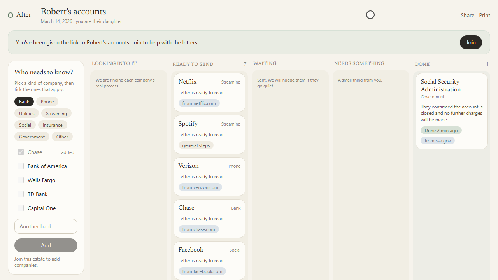
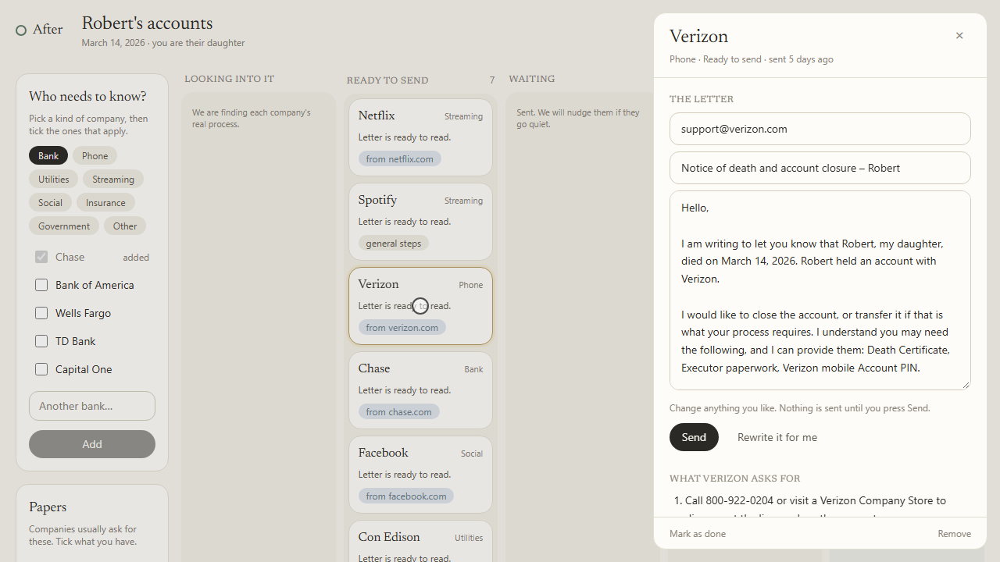
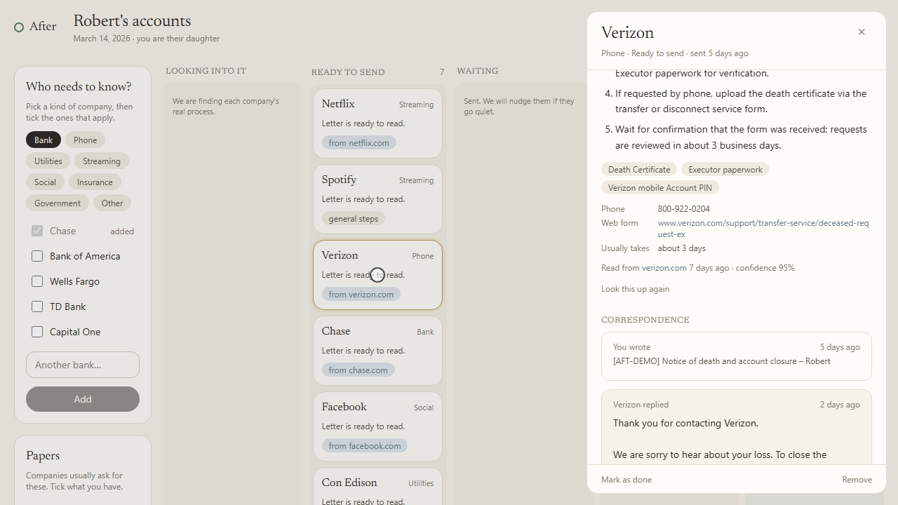
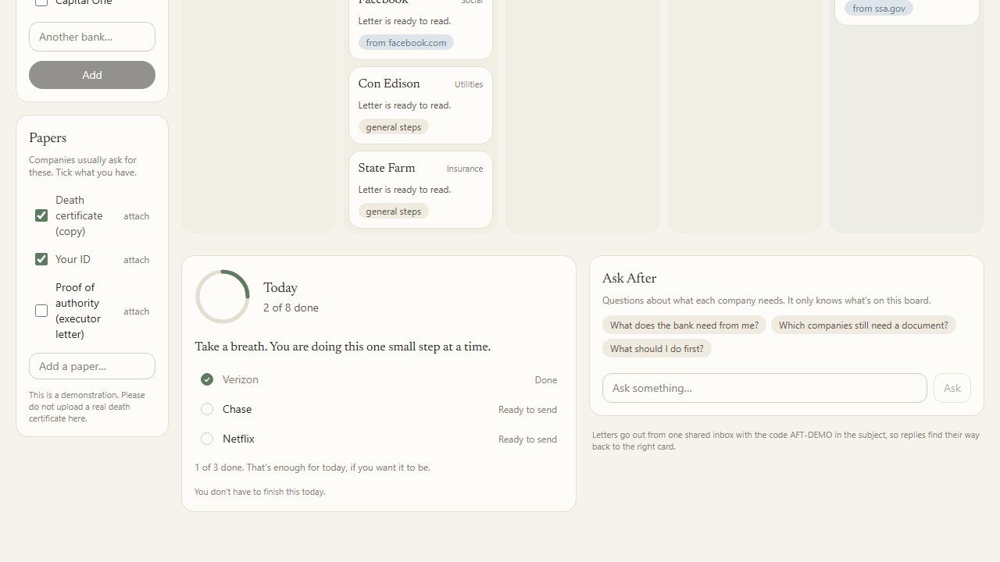

# After

*The letters, forms and follow-ups that come after a death — found, written and tracked, so a family doesn't have to.*

🌐 **[Live demo](https://kindred-guanaco-234.convex.site)** (example estate: [Robert's accounts](https://kindred-guanaco-234.convex.site/e/demo-robert)) · 🎥 **Demo video:** [Watch the demo](https://www.youtube.com/watch?v=eZ8eIKz-_tc) · 📓 **[Build log](hackathon.md)**

> The demo runs on the free tiers of Convex, OpenAI, Firecrawl and AgentMail, so under load some features may be rate-limited — the video shows the full flow.

## What this is

After is a small web app for the week after someone dies. You tell it a first name, a date, and how you were related. Then you name the companies that need to know — the bank, the phone company, two streaming services, the insurer — and it finds each company's own instructions for a deceased account holder, writes a plain letter to each one, and keeps track of what comes back.

It is not a legal service and it does not touch anyone's money. It handles the correspondence, which is the part that is mostly typing.

## The problem

A death leaves behind something like forty accounts. Each company has a different process, buried on a different page under a different name — "bereavement", "deceased customer", "estate services". Each wants a slightly different document. Each reply arrives days later, in its own thread, in an inbox that is already full. The work is not hard; it is long, repetitive, and it lands on someone in the worst week of their life, usually while they are also arranging a funeral.

## Our solution

In the order you meet it:

1. **Three questions.** A first name, the date, and your relationship. That is all we keep about the person who died — no address, no account numbers, no last name. You are signed in anonymously, so there is no account to make.
2. **Name the companies.** A checklist by category (bank, phone, utilities, streaming, social, insurance, government), plus a box for anything else. Add as many as you like.
3. **After finds the real procedure.** For each company it searches the web, keeps only results on the company's own domain, picks the page that is actually about deceased account holders, reads it, and turns it into a few plain steps: what they need, who to write to, how long they usually take. The card on the board says what it is doing while it does it — *finding their page*, *reading their instructions*, *writing the letter*.
4. **A letter is drafted for each one.** Short, calm, factual, in the voice of a family member. It says "died", not "passed away". It names the documents that company asked for. It is signed with the relationship only.
5. **You read it, change anything, and press Send.** **Nothing is ever sent without that press.** The draft sits in "Ready to send" until a person approves it. You can edit the text and the recipient, or ask for a rewrite.
6. **Replies come back to the board.** Each letter goes out from one inbox with a short case code in the subject. When a company answers, the reply is matched back to the exact card, summarised in one sentence, and the card moves: *Waiting*, *Needs something*, or *Done*.
7. **Quiet companies get a nudge.** After a week of silence, a follow-up is drafted and left waiting for approval — again, never sent on its own. One nudge per company, by design.
8. **Today.** Each morning the board picks at most three things worth doing, with a sentence at the top that does not push. "Three small things. You don't have to finish this today."
9. **Share it with a sibling.** The board is one link. A second person opens it, joins, and sees the same cards move in real time, with a quiet indicator of who else is looking.
10. **Ask After.** A panel that answers "what does the bank still need from me?" using only this estate's own cards and research.

## How we used each sponsor

| Sponsor | What it does in After | Where in the code |
|---|---|---|
| **Convex** | The whole app: database, live board, background pipeline, email webhook, crons, file storage, auth, components — and it serves the frontend | `convex/` (all), `convex/convex.config.ts`, `convex/http.ts` |
| **OpenAI** | Picks the right support page, extracts each company's procedure as structured JSON, writes and rewrites every letter, classifies every reply, chooses today's three things, and answers "Ask After" | `convex/lib/llm.ts`, `convex/lib/agentModel.ts`, `convex/research.ts`, `convex/ai.ts`, `convex/inbound.ts`, `convex/ask.ts` |
| **Firecrawl** | Finds and reads each company's own bereavement page — search with page content, then a scrape when the result is too thin to extract from | `convex/lib/firecrawl.ts`, `convex/research.ts` |
| **AgentMail** | The app's single inbox: sends every approved letter and receives every reply through a signed webhook | `convex/lib/agentmail.ts`, `convex/mailActions.ts`, `convex/http.ts`, `convex/mail.ts` |

### ⚡ Convex

Convex is not the storage layer here; it is the application.

- **Schema and indexes** — `convex/schema.ts` defines thirteen tables of its own (`estates`, `estateMembers`, `tasks`, `playbooks`, `documents`, `dailyPlan`, `presence`, `mailMessages`, `senderRoutes`, `crawlCache`, `crawlBudget`, `usage`, `settings`) alongside Convex Auth's. Every read goes through an index, and the indexes are shaped by the product: `by_status_followUp` on `(status, nextFollowUpAt)` is exactly what the follow-up cron scans; `by_companyKey` is the shared research cache; `by_threadId`, `by_caseCode` and `by_target` are the three ways an inbound email finds its card.
- **Queries, live everywhere** — `tasks.list` returns every card with its playbook in one subscription; `tasks.thread`, `estates.get`, `estates.todayPlan`, `estates.documents`, `estates.viewers`, `assistant.messages`, `crawlCache.status` and `usage.today` are all `useQuery` in `src/`. Nothing polls. When a background action patches a card, every open board redraws.
- **Mutations** — `estates.create`, `estates.join`, `tasks.addMany`, `tasks.updateDraft`, `tasks.setStatus`, `tasks.redraft`, `tasks.prepareDocumentsReply`, and the human gate, `tasks.approveAndSend`. Send and status changes use `withOptimisticUpdate` (`src/components/TaskDetail.tsx`) so the card moves the instant you click.
- **Actions** — the three sponsor SDKs run in `"use node"` actions only (`convex/research.ts`, `convex/ai.ts`, `convex/send.ts`, `convex/mailActions.ts`, `convex/inbound.ts`, `convex/ask.ts`). No API key is ever in the browser bundle; there is no `VITE_`-prefixed secret.
- **HTTP actions** — `convex/http.ts` routes Convex Auth's endpoints, the AgentMail webhook at `/api/agentmail/webhook` (Svix signature verified with Web Crypto in `convex/lib/svix.ts`), and registers static hosting last as the catch-all.
- **Scheduler** — the whole pipeline is `ctx.scheduler.runAfter`. `tasks.addMany` schedules research per company; `research.lookup` schedules the draft; `tasks.approveAndSend` schedules the send; the webhook stores the message through `mail.ingest`, schedules the classifier and returns 200 immediately, so a slow model can never cause a webhook retry storm. When the rate limiter says wait, `research.lookup` reschedules *itself* with the limiter's own `retryAfter`.
- **Crons** — `convex/crons.ts`: a daily follow-up sweep (`ai.followUpSweep`) and a daily plan build (`ai.buildAllDailyPlans`).
- **File storage** — `estates.documentUploadUrl` issues an upload URL, `estates.attachDocumentFile` attaches it to a paper on the checklist, and `estates.documents` hands back a `ctx.storage.getUrl` link.
- **Convex Auth** — `convex/auth.ts` registers Anonymous and Password. Opening the live URL signs you in anonymously (`src/auth.tsx`), so a judge meets the app and not a login wall; Password exists for coming back later. `requireMember` in `convex/estates.ts` guards every write, and `mail.unrouted` is restricted to accounts with a real email, because anonymous proves nothing.
- **Components** — three, registered in `convex/convex.config.ts`: `@convex-dev/static-hosting` serves this React app from the same deployment (the URL above is `convex.site`, not a separate host), `@convex-dev/rate-limiter` meters every credit-spending path per user *and* globally (`convex/lib/limits.ts`), and `@convex-dev/agent` is the assistant behind **Ask After** — `convex/ask.ts` creates one thread per estate and stores its id on the estate row, so siblings share one conversation, and `convex/assistant.ts` reads it back with `listMessages` as a live query.
- **Presence** — a 20-second heartbeat mutation and a `viewers` query, so you can see when your sister has the board open.

**The shared `playbooks` cache.** A company's procedure is looked up once for everybody. `tasks.addMany` checks `by_companyKey` before it schedules anything, and `research.lookup` checks again before it spends a crawl. The first family to add Netflix pays for the research; the second family gets it instantly and for free. `tasks.upsertPlaybook` refuses to overwrite a real playbook with a generic fallback, so the cache only improves.

### 🔎 Firecrawl

`convex/research.ts` is the whole point of the product, and Firecrawl is what makes it possible.

- **Search with content** — `search(ctx, "<company> deceased account holder bereavement close account", 5)` with `scrapeOptions: { formats: ["markdown"] }`, so the results arrive with page text already attached and most lookups need no second call.
- **Domain filter** — `looksOfficial()` drops forums, news and complaint sites; only pages on something that looks like the company's own domain survive.
- **Scrape** — when the chosen result's text is too thin to extract from, `scrape()` reads the page to markdown.
- **A credit gateway, not a call counter** — every crawl goes through one function in `convex/lib/firecrawl.ts` that serves a stored result when it has one, checks Firecrawl's own free credit-usage endpoint before spending, refuses to go below a reserve or past a daily ceiling, and records what each call cost in `crawlBudget`. A refused crawl is not an error: the family still gets general steps and a letter, and the board says plainly that it is showing saved research.

The source URL, page title, confidence and fetch date stay on the playbook and are shown on the card, so a family can check where a step came from.

### ✉️ AgentMail

Real letters, to real addresses, with real replies coming back.

- **One inbox, created once** — `mailActions.ensureInbox` is idempotent: it looks for an inbox with this app's `clientId` before creating one, so re-running never burns an inbox.
- **Sending** — `send.notify` → `mailActions.send` → `lib/agentmail.sendMail`. The subject carries the estate's case code (e.g. `[AFT-DEMO]`), the outbound row is stored in `mailMessages` with `targetId` set to the card that sent it, and the returned thread id is stored on the task.
- **Fail-closed sending** — outbound mail refuses to leave at all unless the deployment sets either a redirect address for development or an explicit allow-real-sends flag. Nobody emails a real company from a laptop by accident.
- **Receiving** — AgentMail posts `message.received`, `message.delivered` and `message.bounced` to `/api/agentmail/webhook`. The signature is verified before anything is read, `mail.ingest` de-duplicates by message id (webhooks retry), and routing tries thread id, then the case code in the subject matched against the letter that started the conversation, then a registered sender address. Unroutable mail is kept and surfaced on `/admin`, never dropped.
- **The reply moves the board** — `inbound.onInbound` classifies the reply as *closed*, *needs documents*, *needs a call*, *auto-reply* or *other*, writes a one-sentence summary, and patches the card. Delivery failures land as `bounced`.

## How it works

```mermaid
flowchart TB
    UI["Browser — React on convex.site<br/>useQuery · useMutation"]

    subgraph CVX["Convex deployment"]
        Q["queries + mutations<br/>estates.ts · tasks.ts · mail.ts"]
        DB[("tables + indexes<br/>schema.ts")]
        SCH["scheduler"]
        ACT["Node actions<br/>research.ts · ai.ts · send.ts<br/>inbound.ts · ask.ts"]
        HTTP["HTTP actions<br/>http.ts"]
        CRON["crons.ts<br/>follow-up sweep · daily plan"]
    end

    FC["Firecrawl<br/>search · scrape"]
    OAI["OpenAI<br/>choose · extract · write · classify"]
    AM["AgentMail<br/>one inbox"]

    UI -->|"mutations"| Q
    Q -->|"live updates"| UI
    Q <--> DB
    Q --> SCH
    SCH --> ACT
    CRON --> ACT
    ACT <--> DB
    ACT --> FC
    ACT --> OAI
    ACT --> AM
    AM -->|"signed webhook"| HTTP
    HTTP --> DB
    HTTP --> SCH
```



The core loop, function by function:

1. `estates.create` — three fields, one estate, one member row, one case code.
2. `tasks.addMany` — one card per company. If a `playbooks` row already exists for that company key, it skips straight to step 4.
3. `research.lookup` — Firecrawl search → `looksOfficial` filter → OpenAI picks the page → Firecrawl scrape if needed → OpenAI extracts against `PlaybookSchema` → `tasks.upsertPlaybook`. The card's `aiState` is patched at each stage, so the board narrates itself.
4. `ai.draftLetter` — OpenAI writes a subject and body from the estate facts and the playbook. If the model is unavailable or returns a truncated letter, a deterministic template from `convex/lib/product.ts` is used instead and the card says so.
5. `tasks.approveAndSend` — a mutation a human calls. Nothing else in the codebase sends.
6. `send.notify` → `mailActions.send` — the letter leaves the AgentMail inbox; `mail.recordOutbound` stores it against the card.
7. `/api/agentmail/webhook` → `verifySvix` → `mail.ingest` — the reply is stored and routed, and `inbound.onInbound` is scheduled.
8. `inbound.onInbound` → `tasks.patch` — the reply is classified and summarised, and the card moves for everyone watching.
9. `ai.followUpSweep` (cron) — cards silent past their follow-up date get a drafted nudge, left for approval.
10. `ai.buildAllDailyPlans` → `ai.buildDailyPlan` (cron) — at most three things for tomorrow, saved by `estates.savePlan`.

## Screenshots


*The board for the demo estate. Five columns — looking into it, ready to send, waiting, needs something, done — and a checklist on the left for adding more companies.*


*A card open. The recipient, subject and letter are all editable, and the line under them is the whole product promise: nothing is sent until you press Send.*


*Underneath the letter: the steps read off the company's own page, the documents they ask for, their phone number and form, how long they usually take — with the source link, the date it was read, and the correspondence so far.*


*Three things for today, the papers you have and still need, and a panel that answers questions using only this estate's own research.*

## Running it yourself

```bash
pnpm install
pnpm exec convex dev         # creates a deployment, writes CONVEX_DEPLOYMENT and VITE_CONVEX_URL
pnpm dev                     # Vite, against that deployment
pnpm run build               # tsc -b && vite build
pnpm run deploy              # publishes dist/ through the static-hosting component
```

Set these **names** on the Convex deployment (`pnpm exec convex env set NAME VALUE`) — never in the repo, never `VITE_`-prefixed. See `.env.example`.

| Purpose | Variables |
|---|---|
| Convex Auth | `JWT_PRIVATE_KEY`, `JWKS`, `SITE_URL` |
| OpenAI | `LLM_BASE_URL`, `LLM_API_KEY`, `LLM_MODEL`, `LLM_EXTRA_BODY` |
| Firecrawl | `FIRECRAWL_API_KEY`, and optionally `FIRECRAWL_MIN_CREDITS`, `FIRECRAWL_DAILY_CREDITS`, `FIRECRAWL_CACHE_TTL_HOURS` |
| AgentMail | `AGENTMAIL_API_KEY`, `AGENTMAIL_WEBHOOK_SECRET` |
| Safety | `DEMO_RECIPIENT_OVERRIDE` (redirect all mail in development), `ALLOW_REAL_SENDS` (production, deliberate), `APP_PAUSED` (kill switch for everything that spends a credit) |

Point the AgentMail webhook at `https://<your-deployment>.convex.site/api/agentmail/webhook`, then build the demo estate with `pnpm exec convex run seed:prepare`, `seed:status` and `seed:stage`.

## Credits

Built for the **Convex All Gas Hackathon**, sponsored by OpenAI, Firecrawl and AgentMail. Backend, hosting, scheduling and auth by [Convex](https://convex.dev); research by [Firecrawl](https://firecrawl.dev); mail by [AgentMail](https://agentmail.to); writing, extraction and classification by OpenAI. Typeface: Newsreader.

Robert is not a real person, and no real company was emailed while this was built.
